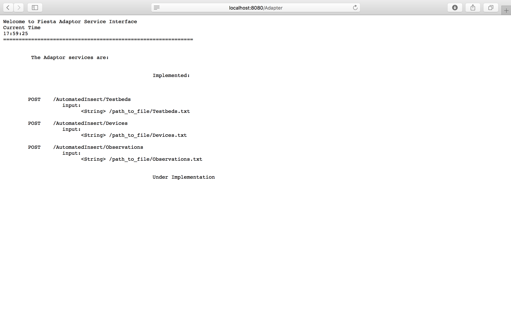

# Fiesta-IoT testing structure by UNPARALLEL

This project is composed by three parts. The Adapter, which is responsible to insert and annotate data to Fiesta-IoT Platform, the Test Generator, which is the module that generate the test data, and the Testing script which coordinate the test executions.

## Getting Started

The Adapter must be running in a WildFly container. It was developed in Eclipse IDE based in WildFly and JAX-RS Rest platform. To use it, it’s needed to change just some parameters, like the OpenAM authentication credentials and the FIESTA-Iot platform instance. To do that, edit the file AnnotatorAsAService.java under “pt.unparallel.fiesta.tps.services” in src folder, and change the string USERNAME and PASSWORD to a known OpenAM user and the serverPath to the desired URL. In the BackdoorRequest.java it’s also needed to change those variables, to allow the user to be authenticated. This module should be available at “http://localhost:8080”.

The Test Generator just needs to be compiled, as a maven install, and defined a properties file that describes some variables. In the same folder, put the “.jar” file and a “config.properties” similar to the one present in this repository. The config.properties stores the area limits to use when comparing queries, and the maximum number testbeds that can be generated. 

The Fiesta Testing script requires a little more attention. It’s needed to change the path to the Test Generator, where the jar is located, the path to where the script is located, the path to where the results will be stored, the OpenAM user name and password variables, the Fista instance URL, the Fiesta instance user and lastly the Fiesta instance machine user and sudo password. A file called “Configs.txt” is also needed and it should be in the same folder as the scripts and the queries. This file contains the variables to make the testes. The script will do one test for each line of this file with the structure “random val1 val2 val3 val4”:
- The val1 represents the maximum number of devices. 
- The val2 represents the minimum number of the devices. 
- The val3 represents the period of observation in hours. 
- The val4 represents the frequency of observation in minutes.

### Prerequisites

For the Unparallel modules, the only prerequisites are Java, Eclipse and Maven. 
For the testing script, it is also needed to install, as global module, an npm module. The Json-diff is a node module to compare json files. It is used to compare the queries. In order to install it, or get some help, go to https://www.npmjs.com/package/json-diff. 
Don’t forget to install it as global package (with the –g flag).

### Installing

The first step is to set the Adapter online. After putting it running on a WildFly container, go to http://localhost:8080/Adapter at it should present a welcome page as:

That welcome file presents the methods implemented in the platform.
After this you are ready to run the script.
Don’t forget to configure all the variables, for more info read Getting Started section of this file.

## License

This project is licensed under the MIT License - see the [LICENSE.md](LICENSE.md) file for details

